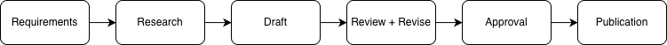

# Technical Writing Portfolio: Liang-Hu S

This repository contains selected writing samples in standard operating procedures, governance briefs, and structured documentation. Samples demonstrate procedural writing, workflow documentation, governance communications, and structured content development for technical and non-technical audiences.

This portfolio reflects 8+ years of documentation and content-development experience, including the production of 3,000+ structured deliverables across research, instructional, governance, and procedural formats.

---

## Featured Samples

### 1. [Employee Onboarding Guide SOP](./docs/sops/sop-onboarding-guide.md)
**Process & Workflow Documentation Sample**
* **Highlights:** Onboarding workflow design, system access provisioning, troubleshooting guidance, process mapping, and user-focused procedural writing.

### 2. [Risk Governance Brief](./docs/governance/risk-governance-brief.md)
**Policy & Governance Brief (Institutional Sample)**
* **Highlights:** Three Lines of Defence (3LoD) alignment, reputational risk mapping, and executive-ready communications.

### 3. [Password Reset SOP](./docs/sops/sop-password-reset.md)
**Technical Procedure Sample**
* **Highlights:** Structured procedural writing, troubleshooting workflows, completion criteria, process mapping, and end-user support documentation..
---

## Repository Structure

This repository is organized by documentation type to support maintainability, discoverability, and version control.

```text
technical-writing-portfolio/
├── README.md
├── CHANGELOG.md
├── docs/
│   ├── communication/
│   │   ├── service-maintenance-notice.md
│   │   └── member-security-notification.md
│   ├── governance/
│   │   ├── risk-governance-brief.md
│   │   └── aml-transaction-escalation-report.md
│   ├── research/
│   │   └── academic-literature-review.md
│   ├── sops/
│   │   ├── sop-onboarding-guide.md
│   │   ├── sop-watch-handling.md
│   │   └── sop-password-reset.md
│   └── diagrams/
│       ├── documentation-lifecycle.png
│       ├── onboarding-workflow.png
│       └── password-reset.png
```
---

## Core Competencies

* SOP Development & Process Documentation
* Workflow Documentation, Process Mapping & Information Architecture
* Governance, Risk & Compliance Communications
* Document Control & Revision Management
* Markdown, XML & Docs-as-Code Workflows
---

## Documentation Tools

* Markdown
* GitHub/Git
* VS Code
* XML Structured Authoring Concepts
* MS Office
* Adobe Acrobat/Photoshop
* Lucidchart/draw.io
* Jira & Confluence
---

## Professional Background

* **B.Sc.** | University of Toronto
* **Financial Planning & Compliance Graduate Certificates** | Seneca Polytechnic
* **Experience:** 8+ years producing high-volume structured written deliverables across research, instructional, and analytical formats
* **Eligibility:** Dual Canadian-U.S. Citizen
* **Location:** Toronto, ON / Rockville, MD
---

## Documentation Lifecycle

This diagram illustrates my documentation development workflow from requirements gathering through publication.

