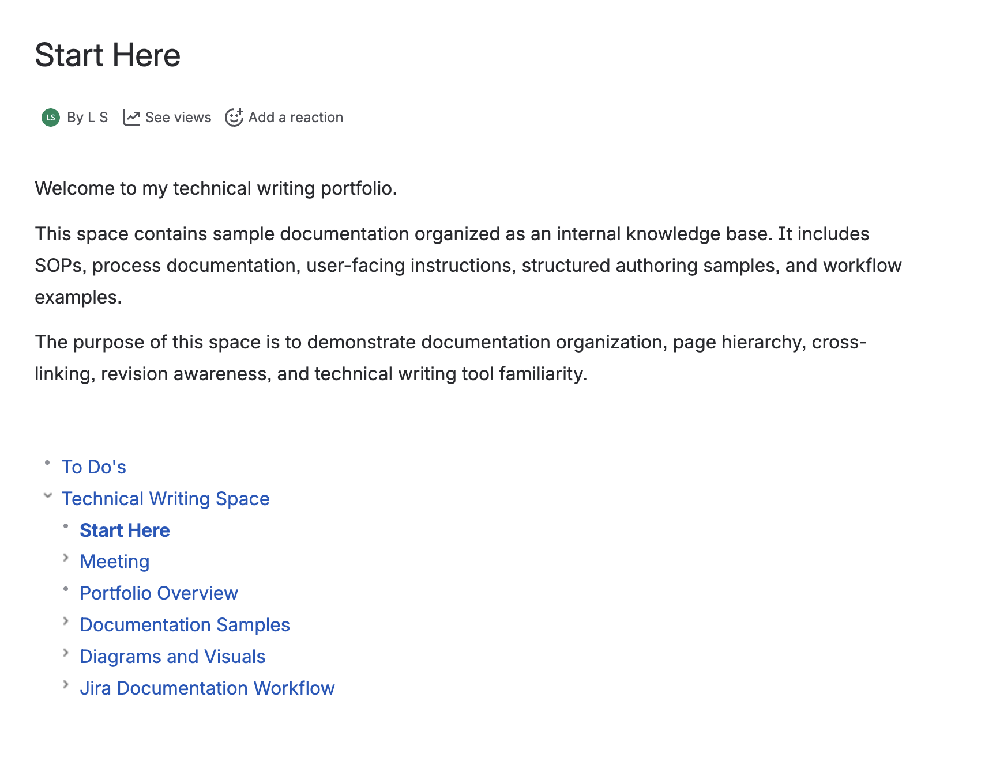
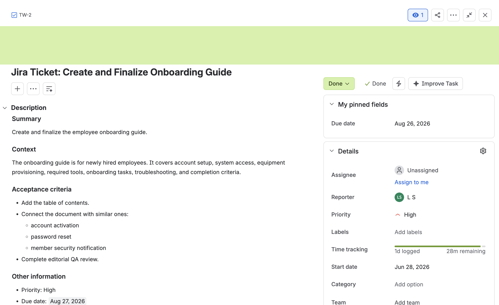

## Confluence Workspace

The documentation set was imported into Confluence and organized by
document type to simulate a centralized internal knowledge base.

## Revision Tracking

A Jira documentation ticket was used to define revision requirements,
acceptance criteria, and completion status.

