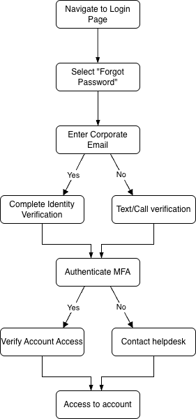

# Employee Password Reset Guide
**Title:** SOP-Password-001 | **Effective Date:** June 2026 | **Last Updated:** June 2026 | **Status:** Published |

# Purpose
This documents provides instructions for employees on resetting their company account passwords and usernames through approved self-service and support channels.

# Scope
This document covers the process one has to take to reset their password, should they wish to change it or lose access to their accounts.
This guide applies to all employees, and encompasses:
- Password changing processes
- Password resetting requests
- Account recovery following credential changes

# Procedural Flow

# Prerequisites
Before an employee can proceed with resetting their passwords, the following criteria have to first be met:
- Finished the onboarding and identity verification processes 
- Employee account created with a distinct username and password created
- Access to own employee emails -- where the reset email will be sent to by default
- Completed multi-factor authentication (MFA) prior
- Logged onto the company's servers and/or VPN

# Inputs
- Company account that has been created
- Access to the company email
- Approved MFA applications (Google, Microsoft Authenticators) intalled on cellphone for verification

# Procedure
## Resetting through company website
1. Go to company website's login page
2. Click on the reset password option below the username and password textboxes
3. Input your company email received during the onboarding process
4. Verify your identity through accepted MFA applications, or through a text message or phone call verification
5. The reset email should be received within 5-10 minutes
> **Note:** If you do not receive your password, contact the helpdesk for further assistance

## Resetting through company software
1. Open the application
2. Click on the reset password option at the bottom of the account landing page
3. Input your company employee ID number and email when prompted
4. The reset email should be received within 5-10 minutes
> **Note:** If you do not have access to your employee ID, refer to earlier emails received during onboarding. Alternatively, visit the helpdesk for further assistance

# Outputs
- Employee has received the reset email
- Employee has successfully reset their passwords
- Accomplished either through the website, software, or the support of helpdesk agent 

# Completion Criteria
- The newly established password should be usable immediately and grant employee access to their email, software, and company intranet
- The passsword reset procedure is communicated to and repeatable by the employee

# Troubleshooting
| Potential Problems | Solution |
| ------ | ------- |
| New password does not grant access | Helpdesk can test or perform a manual reset if needed |
| Employee is locked out while on premises | Helpdesk can unlock the account and manually forward a reset email |
| Employee is locked out when at home | Call the helpdesk support line for remote unlock and reset |
| Identity verification does not work | Use text message or call alternatives for verification |

>[!WARNING]
> Avoid repeatedly trying to login with the wrong/failed password. Should any of the potential problems above be experienced, seek technical support from helpdesk.
> **Account Lockouts:** Can potentially trigger prolonged account lockouts.

# Revision History
| Date | Version # |
| June 2026 | V1.0 |
